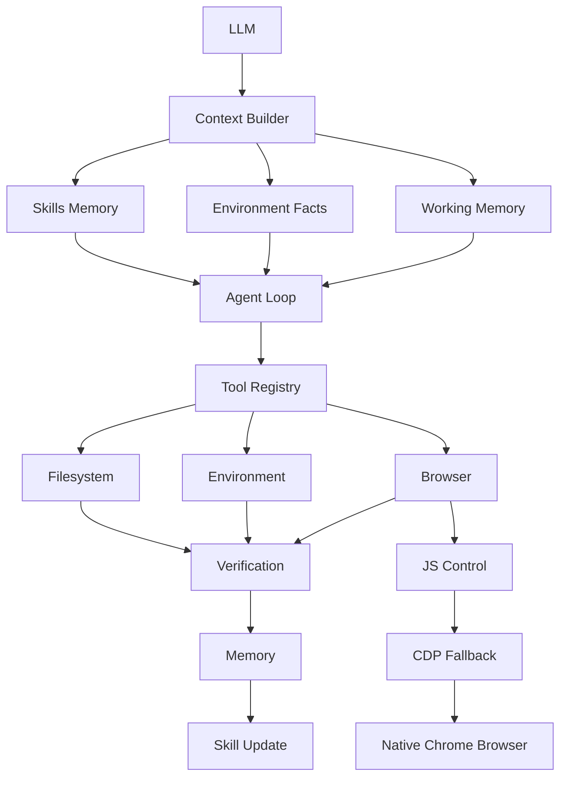
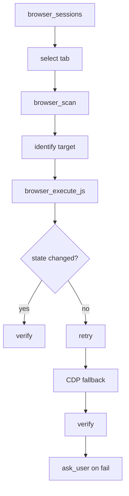

# Pygent

A production-quality, browser-focused Python AI agent that builds its own skills, evolves its environment, and retains long-term memory. 

## What Pygent Is

Pygent is a lightweight, dependency-minimal agent architecture designed around **browser control as the primary execution environment**. Unlike traditional agents that run terminal commands as their main feedback loop, Pygent interacts with existing, authenticated user browser sessions. It learns from its successes and failures, storing verifiable procedures as reusable "Skills" and indexing state as "Environment Facts."

## Why Browser Control Matters

Most valuable tasks require authentication, CAPTCHA bypasses, and complex session state. Headless browsers orchestrated by Puppeteer or Playwright struggle here. 
Pygent solves this by connecting to your **existing, native Chrome browser session**. 
The browser produces the valuable experience, and Pygent leverages it without disrupting your login states or security constraints.

## Architecture



## How the Browser Bridge Works

Pygent relies on a layered approach for browser control:
1. **Chrome Extension**: The primary communication channel. It injects a local bridge to interact with Pygent.
2. **JavaScript Execution**: Actions are performed by dispatching synthesized JS events within the page context.
3. **CDP Fallback**: For actions that JS cannot perform (like complex native file uploads), Pygent falls back to the Chrome DevTools Protocol (CDP).

### Browser Execution Lifecycle



## How to Install the Extension

1. Navigate to `chrome://extensions/` in your Chrome browser.
2. Enable **Developer mode** in the top right.
3. Click **Load unpacked**.
4. Select the `extension/` directory located in the root of the Pygent repository.
5. Note the Extension ID. You may need to provide this in your configuration depending on your setup.

## How Memory Works

Pygent uses a tiered SQLite FTS5 architecture:
- **L0 System rules**: Base agent instructions.
- **L1 Memory index**: FTS tables for quick retrieval.
- **L2 Environment facts**: Discovered truths about the host system.
- **L3 Skills / SOPs**: Markdown-formatted Standard Operating Procedures.
- **L4 Archived sessions**: Past interactions.

Memory is highly contextual: Pygent only injects context into the LLM prompt based on relevance, recency, and confidence, keeping the prompt minimal. 

## How Skills Evolve

When Pygent faces a new task, it explores to find a solution. Once verified, it creates a candidate **Skill** and stores it. 
Next time, it retrieves that skill and re-executes the known working steps. 
Skills carry a `confidence` score, `success_count`, and `failure_count`. If a web page updates and a skill fails, its confidence decreases. The agent will fallback to exploration, find a new path, and update the skill.

## How Environment Growth Works

Pygent isn't limited to what it has at startup. 
If an action requires a missing dependency (e.g., a CLI tool), Pygent probes the environment. If it's missing, it attempts to install or repair it, verifies the installation, and stores this as an Environment Fact. 

*Note: Critical system changes require user permission.*

## How to Run Browser Mode

1. Ensure your Chrome browser is running with remote debugging enabled (required for CDP fallback):
   ```bash
   google-chrome --remote-debugging-port=9222
   ```
2. Start the agent:
   ```bash
   python main.py
   ```
3. Ask it to perform a browser task:
   ```
   > Go to example.com and extract the main heading.
   ```

## How to Configure Providers

Pygent abstract the LLM provider through a simple interface.
To configure the default OpenAI provider:

```bash
cp .env.example .env
```
Edit `.env`:
```env
OPENAI_API_KEY=sk-your-key-here
DEFAULT_MODEL=gpt-4o
MAX_AGENT_STEPS=8
```

To add a new provider, implement `BaseProvider` in `providers/base.py` and register it in `config.py` or your dependency injection setup.

## Security Limitations

- **Tool Policy**: High-risk actions (e.g., sudo, credential changes, package installation) are intercepted by a risk classifier.
- **Ask User**: Any high-risk action triggers an `ask_user` tool execution. The user MUST explicitly approve the action before Pygent can proceed.
- **Privacy Filter**: API keys and secrets are scrubbed via regex before being committed to long-term memory.
- **No Unrestricted Automation**: Environment growth is sandboxed where possible; avoid running Pygent as root.

## Troubleshooting

- **Agent cannot connect to browser**: 
  - Ensure the Chrome Extension is installed and active.
  - Verify Chrome was started with `--remote-debugging-port=9222`.
- **Memory not persisting**:
  - Check file permissions for `~/.agent_memory.db`.
- **Browser actions failing**:
  - The page might be intercepting synthetic JS events. Pygent will attempt to fallback to CDP. Ensure the debugging port is reachable.
- **Context limit reached**:
  - Pygent compresses context automatically. If it's failing, try simplifying the task to allow Pygent to generate a specialized Skill first.

## License

MIT — see [LICENSE](LICENSE) for details.
